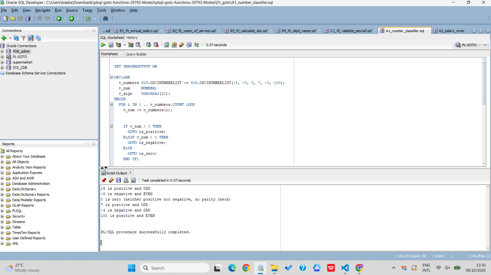
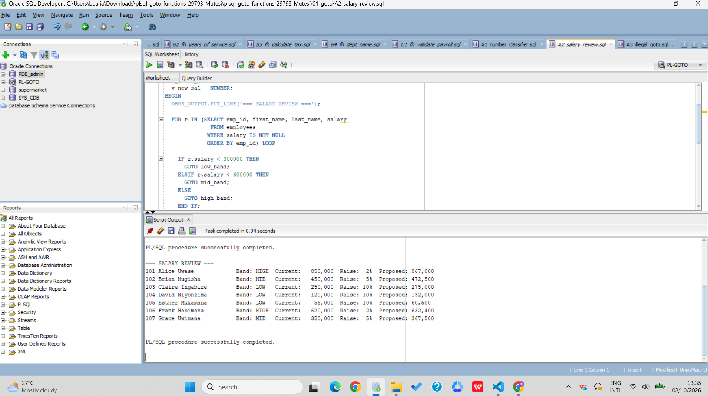
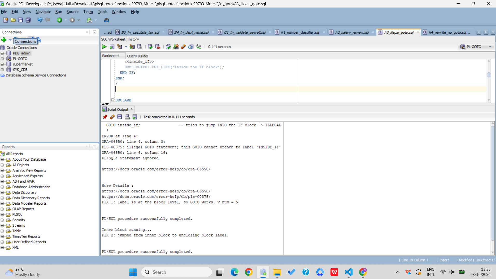
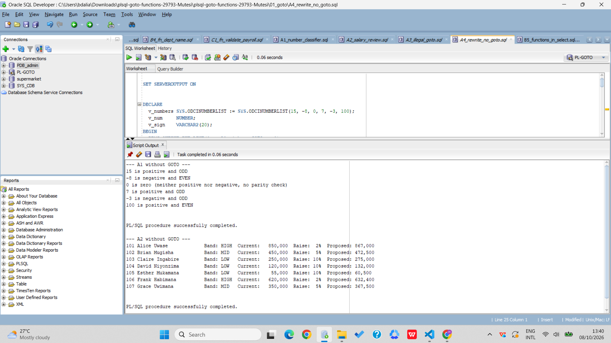
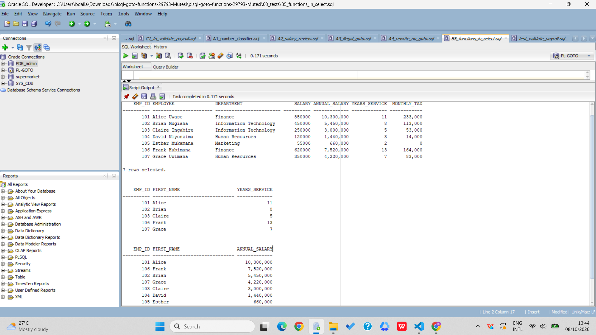
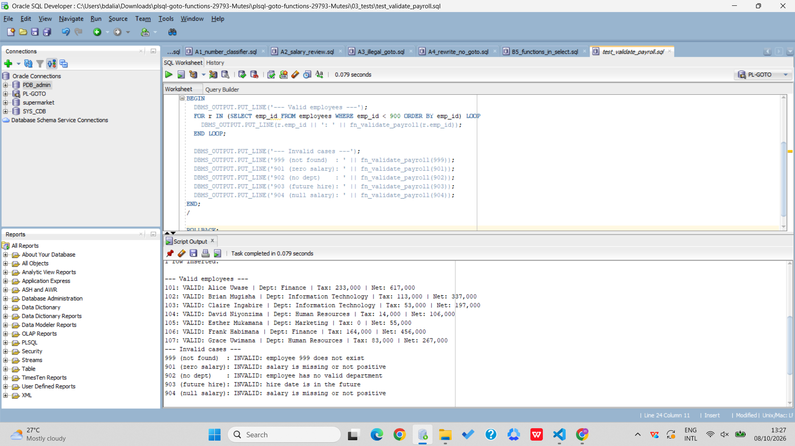

# PL/SQL GOTO Statements and Functions — Individual Assignment III


##  Student Information

| Field | Details |
|---|---|
| **Student Name** | **Mutesi Liza Phiona** |
| **Student ID** | **29793** |
| **Course** | Database Development with PL/SQL (INSY 8311) |
| **Instructor** | Eric Maniraguha |
| **Assignment** | Individual Assignment III |
| **Topic** | PL/SQL GOTO Statements and Functions |
| **Date** | October 7, 2026 |

---

##  Assignment Overview

This repository contains my implementation of **Individual Assignment III** for Database Development with PL/SQL.

The assignment focuses on practical use of:

- PL/SQL `GOTO` statements
- Stored functions
- Exception handling
- Functions used inside SQL statements
- Validation and error handling
- Structured programming without `GOTO`
- GitHub repository organization and documentation

The assignment is divided into three main sections:

### Part A — GOTO Statements
- **A1:** Number Classifier
- **A2:** Salary Review
- **A3:** Illegal GOTO and Fix
- **A4:** Rewrite Without GOTO

### Part B — Stored Functions
- **B1:** Annual Salary
- **B2:** Years of Service
- **B3:** Tax Calculator
- **B4:** Department Name
- **B5:** Functions in SQL

### Part C — Combined Task
- **C1:** Payroll Validator
- **C2:** Reflection


#  Database Setup

The project uses two main tables:

### `DEPARTMENTS`

Stores department information.

| Column | Description |
|---|---|
| `DEPT_ID` | Unique department identifier |
| `DEPT_NAME` | Department name |

### `EMPLOYEES`

Stores employee payroll information.

| Column | Description |
|---|---|
| `EMP_ID` | Unique employee identifier |
| `FIRST_NAME` | Employee first name |
| `LAST_NAME` | Employee last name |


#  Part A — GOTO Statements

## A1 — Number Classifier




## A2 — Salary Review



## A3 — Illegal GOTO and Fix



## A4 — Rewrite Without GOTO




#  Part B — Stored Functions

## B1 — Annual Salary

**File:**

```text
02_functions/B1_fn_annual_salary.sql
```

### Function

```text
fn_annual_salary(p_emp_id)
```

### Calculation

```text
Annual Salary = Monthly Salary × 12 + Yearly Bonus
```

If the bonus is `NULL`, it is treated as zero.

The function also handles an employee ID that does not exist by raising an application error.

---

## B2 — Years of Service

**File:**

```text
02_functions/B2_fn_years_of_service.sql
```

### Function

```text
fn_years_of_service(p_emp_id)
```

The function calculates the employee's complete years of service using the employee's `HIRE_DATE` and the current date.

The calculation uses:

```sql
TRUNC(MONTHS_BETWEEN(SYSDATE, hire_date) / 12)
```

The function also validates that the employee exists and that the hire date is not in the future.

---

## B3 — Tax Calculator

**File:**

```text
02_functions/B3_fn_calculate_tax.sql
```

### Function

```text
fn_calculate_tax(p_salary)
```

The function calculates progressive monthly tax according to the brackets implemented in this project:

| Monthly Salary | Tax |
|---:|---:|
| 0–60,000 RWF | 0% |
| 60,001–100,000 RWF | 20% of amount above 60,000 |
| Above 100,000 RWF | 8,000 + 30% of amount above 100,000 |

Negative or `NULL` salaries are rejected using `RAISE_APPLICATION_ERROR`.

---

## B4 — Department Name

**File:**

```text
02_functions/B4_fn_dept_name.sql
```

### Function

```text
fn_dept_name(p_dept_id)
```

The function receives a department ID and returns its department name.

If the department does not exist or the department ID is `NULL`, the function returns:

```text
Unknown
```

---

#  B5 — Functions Used in SQL



#  Part C — Payroll Validator

## C1 — Payroll Validator




# 📚 Key PL/SQL Concepts Demonstrated

### GOTO

```sql
GOTO label;

<<label>>
DBMS_OUTPUT.PUT_LINE('Message');
```

A `GOTO` transfers execution to a labeled statement.

### Stored Function

```sql
CREATE OR REPLACE FUNCTION function_name (...)
RETURN datatype
IS
BEGIN
    ...
    RETURN value;
END;
/
```

A function must return a value.

### Exception Handling

The project demonstrates:

```sql
NO_DATA_FOUND
```

and:

```sql
RAISE_APPLICATION_ERROR
```

for handling invalid situations.

### `%TYPE`

The project uses `%TYPE` to derive variable types from table columns.

Example:

```sql
v_salary employees.salary%TYPE;
```

### `%ROWTYPE`

The payroll validator uses `%ROWTYPE` to represent a complete employee record.

Example:

```sql
v_emp employees%ROWTYPE;
```

---


##  Conclusion

This project demonstrates practical application of **PL/SQL GOTO statements, stored functions, exception handling, SQL-integrated functions, validation, testing, and GitHub documentation**.

The main objective was not only to produce working SQL scripts, but also to understand how PL/SQL control flow and reusable functions can be applied to real database and payroll-related scenarios.
